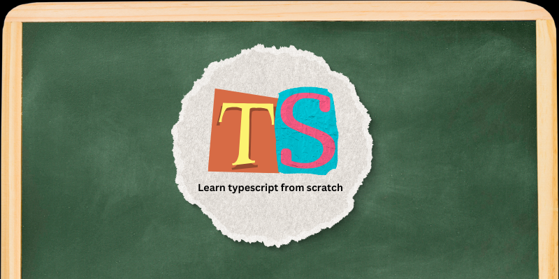

# learnTS



# Why should you learn from me/with me?
- Too be frank, you shouldn't. 
- Lol just kidding, yeah agreed I'm not that good at TS right now to teach anyone 
but you can definatley learn with me because it would be so much fun and we 
- can help each other stay consistent.Join me if you're up for this. 
[You can connect with me on my twitter](https://twitter.com/akashhuyaar)

# How to setup 
You can do it using npm or pnpm or yarn.

If you want to do it fancy way you can do it with vscode packages but I'm not free unlike you so I'll use pnpm.

I used pnpm becase obviously huh😮‍💨, Who uses slow boring npm now?
[pnpm installation](https://pnpm.io/installation)

### So how to install typescript
> I wanted to install ts globally but for some reason pnpm doesn't letting me do that. (help!!🥲)

```
pnpm add typescript
```
[Install using vscode packages](https://www.typescriptlang.org/download)

## DAY 1
Now so if you're done with this let's see what we will learn today?
- [x] How to compile TS file.
- [x] We will get basic intro to typescipt how it work and how you can declare type of any variable. 
- [x] And some best practices about declaring variables.

## DAY 2
Today we're learning functionsss and type alias
- [x] How to use types with function //basic stuff lame
- [x] Error in TS regarding functions
- [x] Type alias also how to use some keywords
- [x] Arrays
- [x] Union Types

## DAY 3
Today we're learning Tuple, Enum and Interface.
> Tuples
- [x] Basic understanding of tuples
- [x] How can you use it
- [x] Heads up about problem with tuples in TS

> Enum
- [x] Basics, how they can be useful to you

> Interface
- [x] Basics
- [x] A few functionalities

And it's a wrap for today.

